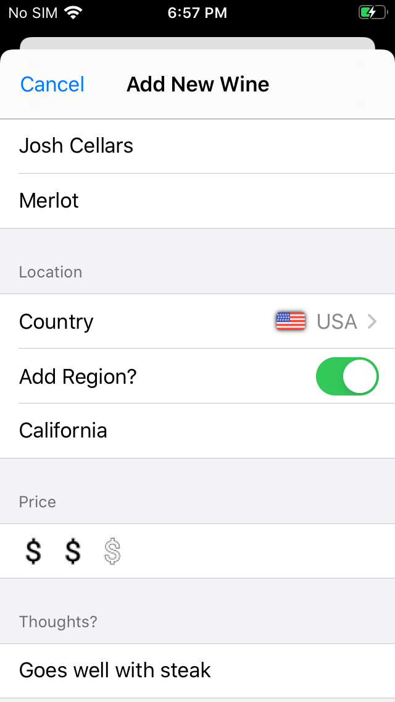

# WineTimeCoreData
iOS app that allows users to create a library of their favorite wine. App leverage Apple’s Core Data to record information such as the type, price, rating, comments and label image.

## Screenshots
  

## Motivation 
Wanted to keep a personal journal to remember wines that I have enjoyed. Thought it would be useful if the list contained information about the wine to make it easier to find in a store, such as the country and grape type. 

## Features 
* Ability to add information including a photo, wine type, name, grape, country, region, price and comments about a wine bottle
* Can view a list of all saved wines, grouped by type

## Challenges 
* Had some difficulties with the format of the image after it was selected with the ImagePicker, found a way to calculate the aspect ratio so that it rendered properly

## Things I learned:
* Utilized Core Data to persist data, had made a previous version of the app where all data was saved to the app’s documents directory
* Used a UIKit view controller in a SwiftUI view; created a wrapper for the UIKit ImagePicker component so that it could be used in SwiftUI
* Handled moving the view up when the keyboard appears to prevent the keyboard from covering the text box

## Future improvements
* Add a feature to share a wine information via messages, email or social media

